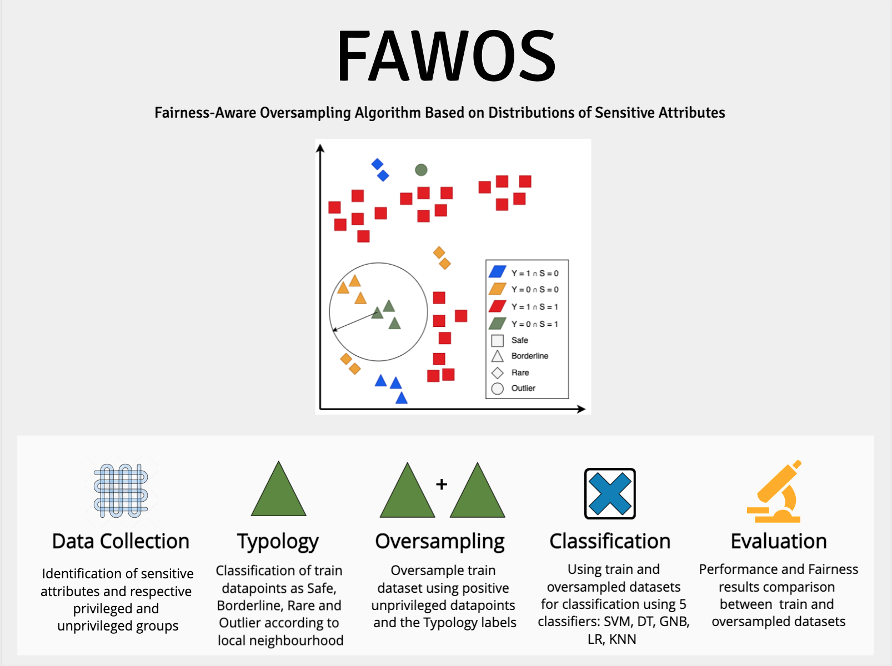

# FAWOS: Fairness-Aware Oversampling Algorithm Based on Distributions of Sensitive Attributes

by
Teresa Salazar,
Miriam Seoane Santos,
Helder Araujo,
Pedro Henriques Abreu

This paper has been submitted for publication was publisher in IEEE Access (https://ieeexplore.ieee.org/document/9442706), 27 May 2021.

> FAWOS is a Fairness-Aware oversampling algorithm which aims to attenuate unfair treatment by handling sensitive attributes' imbalance. It categorizes different types of datapoints according to their local neighbourhood with respect to the sensitive attributes, identifying which are more difficult to learn by the classifiers. FAWOS oversamples the data by creating new synthetic datapoints using the different types of datapoints identified.

## Abstract

>With the increased use of machine learning algorithms to make decisions which impact people's lives, it is of extreme importance to ensure that predictions do not prejudice subgroups of the population with respect to sensitive attributes such as race or gender. Discrimination occurs when the probability of a positive outcome changes across privileged and unprivileged groups defined by the sensitive attributes. It has been shown that this bias can be originated from imbalanced data contexts where one of the classes contains a much smaller number of instances than the other classes. It is also important to identify the nature of the imbalanced data, including the characteristics of the minority classes' distribution. This paper presents FAWOS: a Fairness-Aware oversampling algorithm which aims to attenuate unfair treatment by handling sensitive attributes' imbalance. We categorize different types of datapoints according to their local neighbourhood with respect to the sensitive attributes, identifying which are more difficult to learn by the classifiers. In order to balance the dataset, FAWOS oversamples the training data by creating new synthetic datapoints using the different types of datapoints identified. We test the impact of FAWOS on different learning classifiers and analyse which can better handle sensitive attribute imbalance. Empirically, we observe that this algorithm can effectively increase the fairness results of the classifiers while not neglecting the classification performance.

## General Structure

All source code used to generate the results and figures in the paper are in
the `code` folder.
The datasets used in this study is provided in `datasets`.
Results generated by the code are saved in the respective dataset folder.

## Dependencies

You'll need a working Python environment to run the code.
The required dependencies are specified in the file `requirements.txt`.

You can install all required dependencies by running:

    pip install -r requirements.txt

## Reproducing the results

To build and test the software and produce all results run this in the top level of the repository:

    sh script.sh
    
To build and test the software and produce results for a specific dataset, oversampling factor and taxonomy weights:

    python3 main.py --dataset DATASET_NAME --test_size 0.3 --oversampling_factor OVERSAMPLING_FACTOR --taxonomy_weights SAFE_WEIGHT BORDERLINE_WEIGHT RARE_WEIGHT --n_runs 10

## Running the code with your own dataset

To build and test the software and produce all results on your own dataset you will need to:

- create a new directory on the `datasets` with the name of your dataset
- add a file with the name `raw_dataset.csv` with your raw dataset
- create a Model (following, for example, the file Credit.py) where you define the TargetClass, SensitiveClasses, and Features of each type (e.g. ordinal, Continuous, Categorical)
- add a new condition in the `get_dataset` method of `main.py` in which given the dataset name a new Model is generated.

## License

All source code is made available under a Creative Commons License license. (https://creativecommons.org/licenses/by/4.0/)
